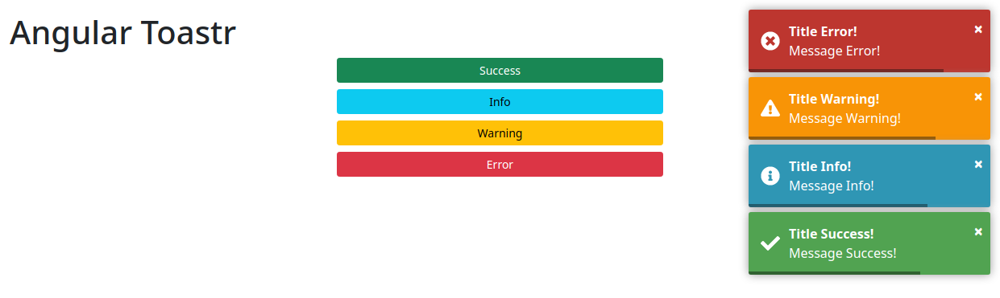

# Angular Toastr


Application example built with [Angular 12](https://angular.io/) and adding the notification component using the [ngx-toastr](https://www.npmjs.com/package/ngx-toastr) library.

This post was made on my [blog](https://rodrigo.kamada.com.br/blog/adicionando-o-componente-de-notificacao-em-uma-aplicacao-angular) in portuguese and on the [DEV Community]().

Available in:

* [GitHub Pages](https://rodrigokamada.github.io/angular-toastr/)
* [Stackblitz](https://stackblitz.com/edit/angular12-toastr)


[](https://rodrigo.kamada.com.br)
[](https://www.linkedin.com/in/rodrigokamada)
[](https://twitter.com/rodrigokamada)


## Prerequisites


Before you start, you need to install and configure the tools:

* [git](https://git-scm.com/)
* [Node.js and npm](https://nodejs.org/)
* [Angular CLI](https://angular.io/cli)
* IDE (e.g. [Visual Studio Code](https://code.visualstudio.com/))


## Getting started


### Create the Angular application


**1.** Let's create the application with the Angular base structure using the `@angular/cli` with the route file and the SCSS style format.

```shell
ng new angular-toastr
? Would you like to add Angular routing? Yes
? Which stylesheet format would you like to use? SCSS   [ https://sass-lang.com/documentation/syntax#scss                ]
CREATE angular-toastr/README.md (1059 bytes)
CREATE angular-toastr/.editorconfig (274 bytes)
CREATE angular-toastr/.gitignore (604 bytes)
CREATE angular-toastr/angular.json (3255 bytes)
CREATE angular-toastr/package.json (1076 bytes)
CREATE angular-toastr/tsconfig.json (783 bytes)
CREATE angular-toastr/.browserslistrc (703 bytes)
CREATE angular-toastr/karma.conf.js (1431 bytes)
CREATE angular-toastr/tsconfig.app.json (287 bytes)
CREATE angular-toastr/tsconfig.spec.json (333 bytes)
CREATE angular-toastr/src/favicon.ico (948 bytes)
CREATE angular-toastr/src/index.html (299 bytes)
CREATE angular-toastr/src/main.ts (372 bytes)
CREATE angular-toastr/src/polyfills.ts (2820 bytes)
CREATE angular-toastr/src/styles.scss (80 bytes)
CREATE angular-toastr/src/test.ts (788 bytes)
CREATE angular-toastr/src/assets/.gitkeep (0 bytes)
CREATE angular-toastr/src/environments/environment.prod.ts (51 bytes)
CREATE angular-toastr/src/environments/environment.ts (658 bytes)
CREATE angular-toastr/src/app/app-routing.module.ts (245 bytes)
CREATE angular-toastr/src/app/app.module.ts (393 bytes)
CREATE angular-toastr/src/app/app.component.scss (0 bytes)
CREATE angular-toastr/src/app/app.component.html (24617 bytes)
CREATE angular-toastr/src/app/app.component.spec.ts (1097 bytes)
CREATE angular-toastr/src/app/app.component.ts (219 bytes)
✔ Packages installed successfully.
```

**2.** Install and configure the Bootstrap CSS framework. Do steps 2 and 3 of the post *[Adding the Bootstrap CSS framework to an Angular application](https://dev.to/rodrigokamada/adding-the-bootstrap-css-framework-to-an-angular-application-2k40)*.

**3.** Install the `ngx-toastr` library.

```shell
npm install ngx-toastr
```

**4.** Configure the `ngx-toastr` library. Change the `angular.json` file and add the `toastr.css` file as below.

```json
"styles": [
  "node_modules/bootstrap/scss/bootstrap.scss",
  "node_modules/ngx-toastr/toastr.css",
  "src/styles.scss"
],
```

**5.** Import the `BrowserAnimationsModule` and `ToastrModule` modules. Change the `app.module.ts` file and add the lines as below.

```typescript
import { BrowserAnimationsModule } from '@angular/platform-browser/animations';
import { ToastrModule } from 'ngx-toastr';

imports: [
  BrowserModule,
  BrowserAnimationsModule,
  ToastrModule.forRoot({
    timeOut: 150000, // 15 seconds
    closeButton: true,
    progressBar: true,
  }),
  AppRoutingModule,
],
```

**6.** Remove the contents of the `AppComponent` class from the `src/app/app.component.ts` file. Import the `ToastrService` service and create the `showSuccess`, `showInfo`, `showWarning` and `showError` methods as below:

```typescript
import { Component } from '@angular/core';
import { ToastrService } from 'ngx-toastr';

@Component({
  selector: 'app-root',
  templateUrl: './app.component.html',
  styleUrls: ['./app.component.scss'],
})
export class AppComponent {

  constructor(private toastrService: ToastrService) {
  }

  public showSuccess(): void {
    this.toastrService.success('Message Success!', 'Title Success!');
  }

  public showInfo(): void {
    this.toastrService.info('Message Info!', 'Title Info!');
  }

  public showWarning(): void {
    this.toastrService.warning('Message Warning!', 'Title Warning!');
  }

  public showError(): void {
    this.toastrService.error('Message Error!', 'Title Error!');
  }

}
```

**7.** Remove the contents of the `src/app/app.component.html` file. Add the buttons as below:

```html
<div class="container-fluid py-3">
  <h1>Angular Toastr</h1>

  <div class="d-grid gap-2 col-4 mx-auto">
    <button type="button" class="btn btn-sm btn-success" (click)="showSuccess()">Success</button>
    <button type="button" class="btn btn-sm btn-info" (click)="showInfo()">Info</button>
    <button type="button" class="btn btn-sm btn-warning" (click)="showWarning()">Warning</button>
    <button type="button" class="btn btn-sm btn-danger" (click)="showError()">Error</button>
  </div>
</div>
```

**8.** Run the application with the command below:

```shell
npm start

> angular-toastr@1.0.0 start
> ng serve

✔ Browser application bundle generation complete.

Initial Chunk Files | Names         |      Size
vendor.js           | vendor        |   2.70 MB
styles.css          | styles        | 273.40 kB
polyfills.js        | polyfills     | 128.51 kB
scripts.js          | scripts       |  76.67 kB
main.js             | main          |  12.35 kB
runtime.js          | runtime       |   6.63 kB

                    | Initial Total |   3.19 MB

Build at: 2021-08-14T12:47:44.417Z - Hash: f001123d671f4d692c5a - Time: 11454ms

** Angular Live Development Server is listening on localhost:4200, open your browser on http://localhost:4200/ **


✔ Compiled successfully.
```

**9.** Ready! Access the URL `http://localhost:4200/` and check if the application is working.




## Cloning the application

**1.** Clone the repository.

```shell
git clone git@github.com:rodrigokamada/angular-toastr.git
```

**2.** Install the dependencies.

```shell
npm ci
```


**3.** Run the application.

```shell
npm start
```
